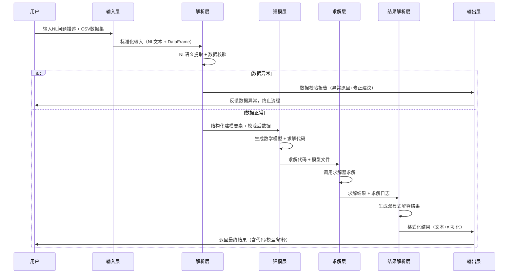

<style>
table {
    width: 100% !important; /* 强制表格宽度占满页面 */
    table-layout: fixed !important; /* 启用固定布局以控制列宽 */
    word-break: break-word !important; /* 允许在单词内换行 */
    overflow-wrap: break-word !important; /* 处理长字符串换行 */
}
th, td {
    white-space: normal !important;
}
</style>
# 运筹学“智能体”

## 一、探索与需求分析

### 1.1 计划的 Milestone

- [ ] 完成核心流程验证，实现初步**Demo 原型**；
- [ ] 开发面向运筹学入门学生的**教学版本**，支持学习理解、课堂教学与成果演示；
- [ ] 迭代开发面向行业应用的**工程版本**，支持实际场景下的选址决策与模型构建。

> 说明：本次SRT项目周期内，目标为完成前两个Milestone；第三个面向行业落地的Milestone，作为项目后续延伸与迭代方向，暂不纳入本阶段实施范围。

### 1.2 需求分析

核心定位：**端到端教学型NL2OR选址智能体**
- 输入：自然语言问题描述 + 结构化数据集
- 处理流程：全自动运筹模型生成 → 外部求解器调用与求解 → 结果解析
- 输出：**双模式解释结果**
  1. 自然语言解释（人话）：面向入门学习者，清晰说明选址方案、优化逻辑与结果意义；
  2. 专业技术表述（鬼话）：给出标准运筹学数学模型、公式定义、建模逻辑与求解过程信息。

一、系统输入规范（遵循运筹学问题工程化范式）
1. 自然语言：用于描述**建模语义**，包括模型类型（P-median/P-center）、设施数量P、优化目标、约束条件等问题意图；
2. 结构化数据集文件（如CSV格式）：用于承载需求点、候选设施点、需求量等**大规模数值数据**。

端到端约束：自然语言与数据集为必要输入组合，系统基于二者完成完整的自动化建模与求解。

二、数据质量与鲁棒性需求
1. 系统具备数据集合法性与完整性校验能力，可识别缺失值、异常坐标、非法参数、重复节点等典型数据问题；
2. 受限于项目范围与开发资源，**不实现全自动数据清洗功能**，但需以自然语言形式向学习者反馈数据异常原因与修正建议，辅助教学与问题排查。
3. 数据校验模块定位为**增强性功能**，在项目开发中优先级低于核心端到端流程，可根据进度灵活安排实现。

## 二、概要设计
### 2.1 整体架构设计
系统采用**分层模块化架构**，注意模块接口的良定义。整体架构分层如下：

| 层级          | 核心功能                                                                 | 交互关系                                                                 |
|---------------|--------------------------------------------------------------------------|--------------------------------------------------------------------------|
| 输入层        | 接收自然语言问题描述、结构化数据集，完成格式标准化（如CSV解析、NL文本归一化） | 向下传递标准化输入至解析层/数据校验层                                   |
| 解析层        | NL语义解析（提取建模要素）、数据校验（合法性/完整性检查）                 | 将解析后的建模要素传递至建模层；数据异常反馈至输出层（仅提示，不中断流程） |
| 建模层        | 基于NL解析结果+数据集，自动生成标准化运筹学数学模型（P-median/P-center）  | 向求解层输出可被求解器识别的模型文件/代码                               |
| 求解层        | 调用外部求解器完成模型求解，捕获求解状态（可行/不可行/最优解）             | 向结果解析层输出求解结果（目标函数值、变量取值、求解日志）               |
| 结果解析层    | 双模式结果生成（自然语言解释+专业技术表述）                               | 向输出层传递格式化结果                                                   |
| 输出层        | 多格式结果输出（文本/表格/可视化图表（教学辅助））                        | 向用户返回最终结果                                                       |

### 2.2 核心模块职责定义
#### 2.2.1 自然语言（NL）解析模块
- **核心目标**：从非结构化自然语言中提取选址问题的核心建模要素，适配入门学生的自然语言表述习惯（允许口语化、不规范表述）；
- **输入**：归一化后的自然语言文本；
- **输出**：结构化建模要素字典（示例：`{"模型类型":"P-median", "设施数量P":3, "优化目标":"总运输成本最小", "约束条件":["候选点数量≥10", "单个设施服务需求上限≤500"]}`）；
- **核心逻辑**：
  - ？基于规则+轻量NLP（spaCy/HanLP）实现关键词匹配与语义提取；
  - 对模糊表述（如“几个设施”“成本最低”）进行教学式追问/默认值填充（需适配教学场景，保留追问交互以强化学习效果）；
  - 支持P-median/P-center两类核心选址模型的语义解析，后续可扩展。

#### 2.2.2 数据校验模块
- **核心目标**：校验数据集合法性，向学习者反馈异常原因与修正建议（教学导向）；
- **输入**：结构化数据集；
- **输出**：校验报告（含异常类型、异常位置、修正建议）+ 数据可用性标记（可用/不可用）；
- **核心校验维度**：
  | 校验类型       | 校验规则                                                                 | 反馈示例                                                                 |
  |----------------|--------------------------------------------------------------------------|--------------------------------------------------------------------------|
  | 缺失值校验     | 检查需求点坐标、需求量、候选点ID等核心字段是否缺失                       | “数据集第15行需求点坐标（x列）缺失，建议补充坐标值后重新上传”             |
  | 异常值校验     | 检查坐标值（如x/y为负数）、需求量（如负数/超大值）等逻辑异常             | “数据集第8行需求量为-20（非法值），选址问题中需求量需为非负数，建议修正”   |
  | 重复节点校验   | 检查需求点/候选点ID是否重复                                             | “数据集存在2个ID为A003的候选点，建议删除重复行或修改ID后重新上传”         |
  | 参数合法性校验 | 检查设施数量P是否超过候选点数量、是否为正整数                            | “您指定的设施数量P=10超过候选点总数（8个），建议将P调整为≤8的正整数”       |

#### 2.2.3 运筹模型生成模块
- **核心目标**：自动生成标准化运筹学数学模型或基于数据结构良定义的运筹学模型接口；
- **输入**：通过 LLM NL 解析后的建模要素字典 + 校验后的数据集；
- **输出**：结构化模型接口（包含模型类型、变量定义、目标函数定义、约束条件定义、数据映射关系）；
- **核心逻辑**：
  - 基于解析结果，自动构建符合运筹学规范的数学模型接口（如P-median模型接口示例），确保公式、符号与教材一致；
  - 自动匹配数据集字段与模型参数，确保模型接口中的参数定义与数据集字段一一对应（如将数据集中的“需求量”映射至模型参数`d_i`）；
  - 对于解析结果中存在的模糊/冲突建模要素（如设施数量P超过候选点数量），生成教学式分析反馈（“您指定的设施数量P=10超过候选点总数（8个），建议将P调整为≤8的正整数”）。
- **容错逻辑**：需要通过**追问**的方式引导用户修正模糊/冲突的建模要素，确保生成的模型接口具有可行性与教学意义。

#### 2.2.4 求解器调用模块
- **核心目标**：自动生成标准化运筹学数学模型与求解器可执行代码；
- **输入**：NL解析模块输出的建模要素 + 校验后的数据集；
- **输出**：
  - 专业版：LaTeX格式的数学模型（含集合、参数、变量、目标函数、约束条件定义）；
  - 求解版：PuLP/Gurobi/or-tools代码（适配开源求解器，优先PuLP/or-tools）；
- **核心逻辑**：
  - 基于模板化生成数学模型与求解代码，保留代码可读性（教学导向，变量命名贴合教材定义）；
  - 自动匹配数据集字段与模型参数（如将数据集中的“需求量”映射至模型参数`d_i`）；
  - 对不可行模型（如约束冲突）生成教学式分析（“约束条件‘候选点数量≥10’与‘P=15’冲突，因候选点仅8个，建议调整P或约束条件”）。
- **容错逻辑**：捕获求解器报错（如模型语法错误、内存不足），转化为自然语言报错解释（“模型约束条件语法错误：变量 $x_{ij}$ 未定义，建议检查建模逻辑”）。

#### 2.2.5 双模式结果生成模块
- **核心目标**：生成面向不同受众的结果解释，强化教学效果；
- **输入**：求解器输出的原始结果 + 建模要素 + 数据集；
- **输出**：
  - 自然语言版（人话）：“本次P-median选址问题的最优方案为：选择候选点A001、A005、A009作为设施点，总运输成本为12500元。该方案满足‘总运输成本最小’的优化目标，且所有约束条件均被满足（如单个设施服务需求未超过500）”；
  - 专业技术版（鬼话）：包含完整数学模型、目标函数值（`Z*=12500`）、变量取值（`x_{A001}=1, x_{A005}=1, x_{A009}=1`）、求解器日志（迭代次数、对偶间隙）、建模逻辑说明；
- **核心逻辑**：
  - 自然语言版：结合运筹学教材的通俗表述，避免专业术语堆砌；
  - 专业技术版：严格遵循运筹学学术规范，公式、符号与教材一致。

### 2.3 核心接口设计
#### 2.3.1 外部输入接口
| 接口名称       | 输入格式                | 约束条件                                                                 |
|----------------|-------------------------|--------------------------------------------------------------------------|
| NL输入接口     | 字符串（支持中文/英文） | 长度≤500字符，需包含至少1个核心建模要素（模型类型/设施数量/优化目标）     |
| 数据集输入接口 | CSV文件（UTF-8编码）    | 必须包含字段：需求点ID、需求点x坐标、需求点y坐标、需求量、候选点ID、候选点x坐标、候选点y坐标 |

#### 2.3.2 模型接口
要求含有运筹学模型的基本要素：变量定义、目标函数定义、约束条件定义，且格式规范、清晰易读。示例接口设计如下：

```json
{
  "model_type": {
    "type": "P-median",
    "description": "P-median模型旨在选择P个设施点，使得所有需求点到其最近设施点的加权距离之和最小化，适用于需要优化总运输成本的选址问题。",
    "parameters": {
      "P": 3
    }
  },
  "variables": {
    "x_ij": "二元变量，表示需求点i是否由设施点j服务（1表示服务，0表示不服务）"
  },
  "objective": {
    "Z": "总运输成本 = ∑(d_i * c_ij * x_ij)，其中d_i为需求量，c_ij为需求点i与候选点j之间的距离"
  },
  "constraints": [
    "每个需求点必须由且仅由一个设施点服务：∑(x_ij) = 1，∀i",
    "设施点数量限制：∑(y_j) = P，∀j，其中y_j为二元变量，表示候选点j是否被选为设施点",
    "服务能力约束：∑(d_i * x_ij) ≤ 500，∀j，其中d_i为需求量"
  ],
  "data_mapping": {
    "需求点ID": "i",
    "候选点ID": "j",
    "需求量": "d_i",
    "距离矩阵": "c_ij（可通过坐标计算得到）"
  },
  "model_description": [
    "min Z = ∑(d_i * c_ij * x_ij)",
    "s.t. ∑(x_ij) = 1, ∀i",
    "∑(y_j) = P, ∀j",
    "∑(d_i * x_ij) ≤ 500, ∀j",
    "x_ij ∈ {0,1}, y_j ∈ {0,1}"
  ]
}
```

> 说明：上述接口设计示例仅为一种基于P-median模型的可能实现，还需要不断斟酌与优化。

#### 2.3.3 外部输出接口
| 输出形式       | 格式/载体                | 包含内容                                                                 |
|----------------|-------------------------|--------------------------------------------------------------------------|
| 文本输出       | Markdown/纯文本         | 自然语言解释 + 专业技术表述 + 数据校验报告（如有异常）                   |
| 可视化输出（教学辅助） | PNG/SVG图表             | 选址结果分布图（需求点-设施点匹配关系）、目标函数值对比图（可选）         |
| 代码输出（教学）| Python文件              | 自动生成的建模/求解代码（供学生学习、修改、复现）                         |

### 2.4 扩展性设计（面向后续工程版本）
为适配行业应用的工程版本迭代，概要设计阶段预留以下扩展接口/设计：
1. **模型扩展接口**：预留多类型选址模型（如最大覆盖模型、带容量约束的P-median）的解析/建模接口；
2. **求解器扩展接口**：支持自定义求解器接入（如CPLEX、自研求解器）；
3. **大规模数据适配**：预留分批次数据处理、分布式求解的接口设计；
4. **定制化输出接口**：支持行业场景的定制化报告（如选址方案可行性分析、敏感性分析）；
5. **数据清洗扩展**：预留全自动数据清洗模块的接入接口（本阶段仅做校验，工程版本可扩展）。

### 2.5 核心流程时序（Demo/教学版本）


> 重要！必须确保流程中每个模块的输入输出格式严格定义，且模块间接口清晰，避免数据格式不匹配导致的流程中断。
