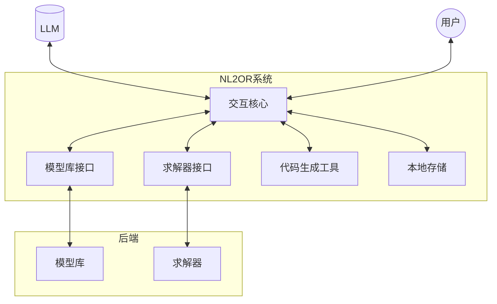
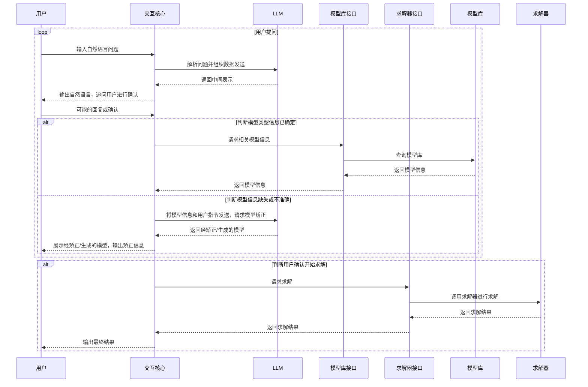

# NL2OR系统流程图

## 模块图

```mermaid
flowchart TD
    subgraph nl2or[NL2OR系统]
        direction TB
        interactCore[交互核心] <--> modelParser[模型库接口]
        interactCore <--> solverInterface[求解器接口]
        interactCore <--> codeGen[代码生成工具]
        interactCore <--> localStorage[本地存储]
    end
    llm[(LLM)] <--> interactCore
    user((用户)) <--> interactCore
    modelParser <--> modelBank[模型库]
    solverInterface <--> solver[求解器]
    subgraph backEnd[后端]
        direction TB
        modelBank
        solver[求解器]
    end
```

## 活动图

```mermaid
sequenceDiagram
    participant User as 用户
    participant InteractCore as 交互核心
    participant LLM as LLM
    participant ModelParser as 模型库接口
    participant SolverInterface as 求解器接口
    participant ModelBank as 模型库
    participant Solver as 求解器
    loop 用户提问
        User->>InteractCore: 输入自然语言问题
        InteractCore->>LLM: 解析问题并组织数据发送
        LLM-->>InteractCore: 返回中间表示
        InteractCore-->>User: 输出自然语言，追问用户进行确认
        User->>InteractCore: 可能的回复或确认
        alt 判断模型类型信息已确定
            InteractCore->>ModelParser: 请求相关模型信息
            ModelParser->>ModelBank: 查询模型库
            ModelBank-->>ModelParser: 返回模型信息
            ModelParser-->>InteractCore: 返回模型信息
        else 判断模型信息缺失或不准确
            InteractCore->>LLM: 将模型信息和用户指令发送，请求模型矫正
            LLM-->>InteractCore: 返回经矫正/生成的模型
            InteractCore-->>User: 展示经矫正/生成的模型，输出矫正信息
        end
    end

    alt 判断用户确认开始求解
        InteractCore->>SolverInterface: 请求求解
        SolverInterface->>Solver: 调用求解器进行求解
        Solver-->>SolverInterface: 返回求解结果
        SolverInterface-->>InteractCore: 返回求解结果
        InteractCore-->>User: 输出最终结果
    end
```

<!-- TODO -->
> 知识库
> 流程：范例 / Example（具体化）
> MVC 架构