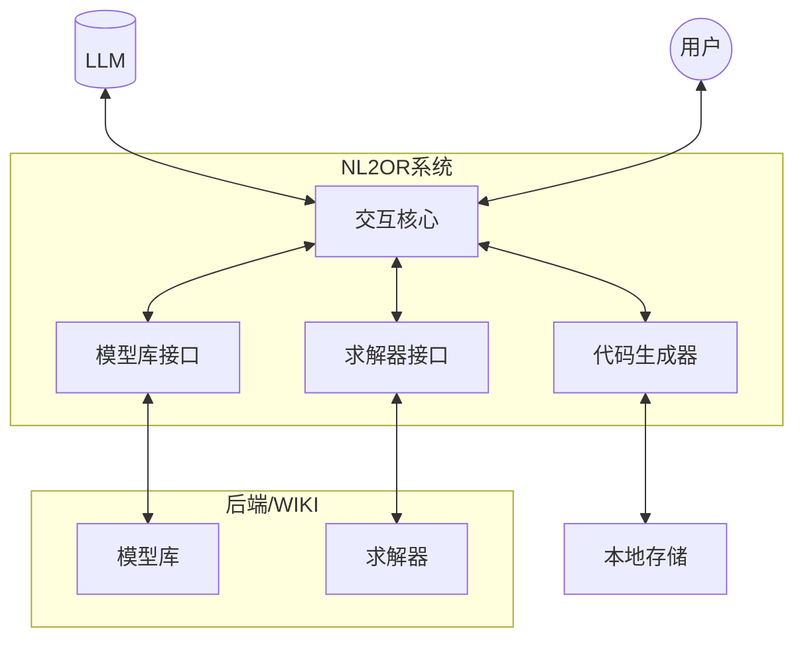
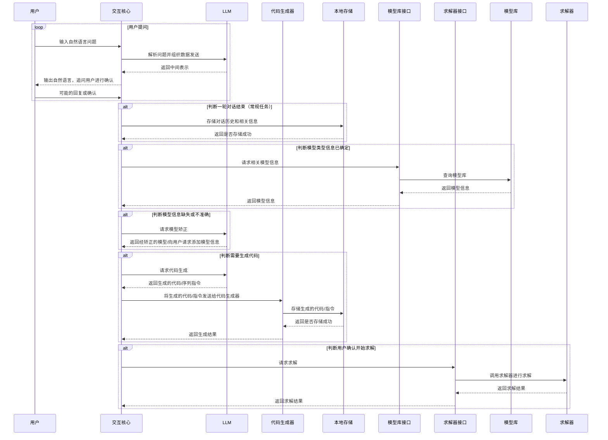
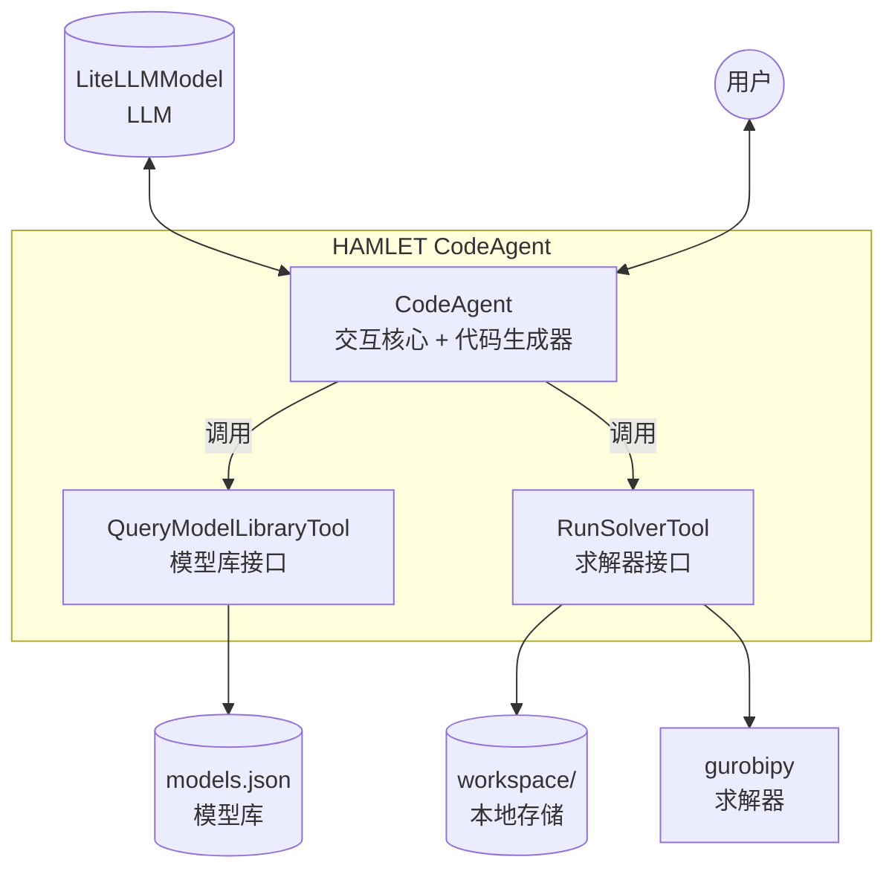

# NL2OR系统流程图

## 模块图



## 活动图



下面阐述各个模块的行为：
1. 交互核心：负责与所有的模块进行交互，主要交互对象分为三类：用户、LLM、处理模块（模型库接口、求解器接口、代码生成器、本地存储）。交互核心的主要职责是协调各个模块之间的交互，确保系统能够顺利地完成用户的请求。最关键的是保证信息流的完整（即**有出有入**），并且在必要时进行**追问**以获取更多信息。
2. LLM：负责解析用户输入的自然语言问题，可以是远端调用（个人推荐），也可以是本地部署。这里主要是想运用大模型的语义理解能力来解析用户的输入（代替死板的规则解析）。
3. 代码生成器：负责将LLM返回的中间表示（包含可执行的代码或我们预先设计好的指令）转换成真实的代码，并且将其存储到本地存储中。这里说的指令像方法接口，此处的设计是为了能够在不同的求解器之间进行适配（即不同求解器可能需要不同的输入格式）。总而言之，其更像是一个抽象层，负责将LLM的输出转换成求解器能够接受的输入。
4. 本地存储：负责存储用户的对话历史、生成的代码/指令以及相关信息。可以采用数据库或者文件系统来实现（其实我觉的文件系统就够用了，不上大量的话不需要数据库）。
5. 模型库接口：负责与模型库进行交互，查询相关的模型信息。
6. 求解器接口：负责与求解器进行交互，调用求解器进行求解，并返回求解结果。
7. 模型库：负责存储各种模型的信息，可以是预先定义好的模型，也可以是用户添加的模型（必须要符合模型的规则以及“人类经验”的条件，也就是不能随意的添加，但必须要有这么个功能）。模型库的设计需要考虑到模型的分类、检索以及更新等功能。【具体的设计需要更多的实验】
8. 求解器：负责执行求解任务，可以是各种不同类型且具有统一接口（这里就涉及分发）的求解器。目前采用 Gurobi 作为开发使用的求解器。

<!-- TODOs -->
> 知识库
> 流程：范例 / Example（具体化）
> MVC 架构
> Raw Resources --generate-> Wiki files <-structure-- Schema (style)
> **结构** + 建模 + 拆分的 tools (functions)
> "上下文"上动态拼接 `skill.md`，知识库

---

## HAMLET 实现映射

> 以下说明当前 `nl2or_agent/` 目录下的实现如何与本流程图对应，使用 [HAMLET](https://github.com/MINDS-THU/HAMLET) 框架（`minds-hamlet` 包）。

### 模块图 → HAMLET 组件



### 活动图 → Agent 执行步骤

| 活动图步骤 | HAMLET 实现 | 位置 |
|-----------|-------------|------|
| 用户输入自然语言问题 | `agent.run(user_input)` | `main.py` |
| 解析问题并组织数据发送 | `CodeAgent` 内置多步推理 + `LiteLLMModel` | `hamlet.core` |
| 返回中间表示，追问用户 | Agent 输出文本，CLI/Gradio 回显 | `main.py` |
| 请求相关模型信息 | `QueryModelLibraryTool.forward(keywords)` | `tools/model_library_tool.py` |
| 查询模型库 | 读取 `data/model_bank/models.json` | `tools/model_library_tool.py` |
| 请求代码生成 | `CodeAgent` 自动生成 Python 代码块并执行 | `hamlet.core` |
| 存储生成的代码 | `RunSolverTool.save_code()` → `data/workspace/` | `tools/solver_tool.py` |
| 调用求解器求解 | `RunSolverTool.forward(code)` → subprocess | `tools/solver_tool.py` |
| 返回求解结果 | stdout/stderr 返回给 Agent，Agent 解释给用户 | `tools/solver_tool.py` |

### 运行方式

```bash
cd nl2or_agent
uv sync                          # 安装依赖
cp .env.example .env             # 配置 API Key
uv run python main.py            # CLI 模式
uv run python main.py --mode web # Gradio 界面
```